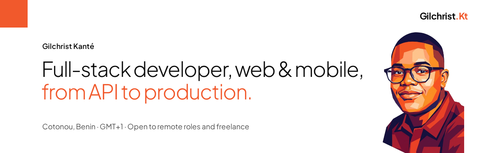

I build web and mobile products in TypeScript and take them all the way to production: the API, the interfaces, the mobile app and the server they run on.

I currently work as a developer at **Atelier Mao** on [MAO Codes](https://mao.codes), artworks you can talk to by text and voice in real time. I am **open to remote roles and freelance missions**.

  
  
  

## In production

Most of this code lives in private client repositories, which is why the links below point to the live products.

| Product | What it is | My part | Stack |
|---|---|---|---|
| [MAO Codes](https://mao.codes) | Artworks you talk to, by text and voice | Mobile app, web and API. Junior tech lead from January to August 2026 | React Native, Expo, React, NestJS, PostgreSQL |
| [Minds3 Academy](https://academy.minds3o.com) | Web3 learning platform | Front-end and back-end, server-side video encoding, VPS deployment | Next.js, NestJS, Prisma, PostgreSQL |
| [Minds Charity](https://charity.minds3o.com) | Crypto donations with a public ledger | Production deployment | Docker, Nginx, Dokku |
| [Santé Plus](https://www.esanteplus.bj) | Digital health passport on an NFC card | Front-end and back-end, built to the project owner's spec | NestJS, Prisma, React |
| [Blue'Ston Connect](https://bluestoneconnect.bj) | NFC business cards | Front-end and back-end, built to the project owner's spec | Next.js, NestJS, Supabase |
| [Miyabi](https://www.miyabi-shops.com) | Custom jewellery store with affiliation | Front-end lead | — |
| [Nubi Bar](https://nubibar.com) | Restaurant menu behind a QR code | Design and build | HTML, CSS, JavaScript |

## Public repositories

- [**AlerteAgri**](https://github.com/misterkante/alerteagri): weather, pest and market alerts for farmers in Benin, over SMS, USSD and an offline PWA. NestJS, React, PostgreSQL.
- [**WhatsApp Transcriber**](https://github.com/misterkante/whatsapp-transcriber): transcribes WhatsApp voice notes on your own machine, no audio leaves it. Python, faster-whisper.
- [**Portfolio**](https://github.com/misterkante/Portfolio_II): the source of [gilchristkante.com](https://gilchristkante.com). Next.js, TypeScript, GSAP.
- [**Post-It**](https://github.com/misterkante/postit): a notes app built at Coding Academy by Epitech. Vue 3, Pinia.

## Stack

  

## How I work

- **I reproduce before I fix.** A bug is proven by a failing test, then fixed.
- **I validate at the boundary.** Data is checked where it enters the API, not somewhere inside a service.
- **I deploy what I build.** VPS, Dokku, Nginx, CI and Sentry: I know what runs in production.
- **AI speeds me up, I stay demanding.** I use Claude Code and Antigravity every day, and every change is still reviewed, tested and checked on a preview before it ships.

French is my working language and I write English professionally. Based in Cotonou, Benin (GMT+1), the same time as Paris in winter.
